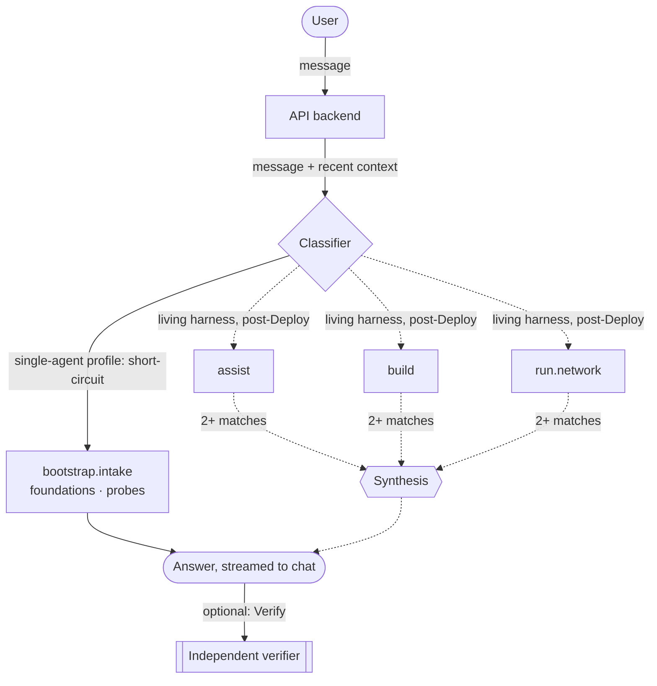

# The Shed

*Your digital shed — the place you go to spend lots of time building, tinkering,
and fixing things.*

The Shed is an agentic-first AI harness with three **jobs**: **Assist** (running
a life), **Build** (projects, features, fixes), and **Run** (the infrastructure
underneath). One chat UI, a growable registry of domain-specific sub-agents.
This repo is the **product** — no tenant hosts, tokens, or credentials live
here. Each deployment is a **tenant**. See
[`docs/architecture.md`](docs/architecture.md).

[shedlife.ai](https://shedlife.ai) is the product domain (secured, not yet
active). It is not a required tenant hostname.

## Macro plan

Jobs classify a message inside a running Shed. **Phases** are how a tenant
comes up. They share names on purpose; they are not the same thing.

| Phase | What it does | Progress |
|---|---|---|
| **1. Bootstrap** | Thin installer → one LXC → setup gate → chat. Collect, validate, and probe the facts Deploy needs. Local secrets and local issues. No GitLab, k3s, or cluster. | **In progress** (MVP). Installer and bootstrap profile are shipping; still iterating on the install path. |
| **2. Deploy** | Stand up foundational platforms from those facts, through the UI, via predetermined playbooks. Candidates (not approved): GitLab CE, Infisical, PowerDNS, k3s, Flux, Let's Encrypt, Traefik, Cloudflared, Postgres, Grafana, Prometheus. | **Not started.** Needs its own grill. Stub: [`docs/prd/deploy.md`](docs/prd/deploy.md). |
| **3. Build** | Add the tools and toys: Proxmox cluster, local AI (Ollama / vLLM / Ray), Splunk. Uses the Build *job*. | **Not started.** Needs its own grill. Stub: [`docs/prd/build.md`](docs/prd/build.md). |
| **4. Run** | AI Ops and patrols over what the earlier phases stood up. Uses the Run *job*. | **Not started.** Needs its own grill. Stub: [`docs/prd/run.md`](docs/prd/run.md). |

Every phase: test-first for deterministic code; Galileo for LLM-facing
behavior; web UI + assistant; predetermined playbooks only; reviewable,
rerunnable, idempotent; unexpected errors become issues.

Detail: [`docs/mvp.md`](docs/mvp.md).

## Prerequisites

- An Anthropic, OpenAI, or Gemini **API key**. A Claude subscription will not
  work.
- One Proxmox host, installed and on the internet.
- A strong root password for that host, stored in a password manager.

## Install (Phase 1)

On the Proxmox host, as root. This always follows GitHub's latest release:

```bash
curl -fsSL https://github.com/andrewkriley/shedlife.ai/releases/latest/download/install.sh | bash
```

To destroy an existing bootstrap CT and install again (testing):

```bash
curl -fsSL https://github.com/andrewkriley/shedlife.ai/releases/latest/download/install.sh | bash -s -- --delete
```

`THESHED_REF` overrides the ref the script clones (a branch or another
release). The script does not ask for an API key. It prints a LAN URL when
the CT has an address, then a completion summary when `/health` succeeds.
Setup happens in the browser.

## How a message becomes an answer



Solid lines are Phase 1. Dashed lines are the living harness already designed
(and partly built) — they wait on later phases.
