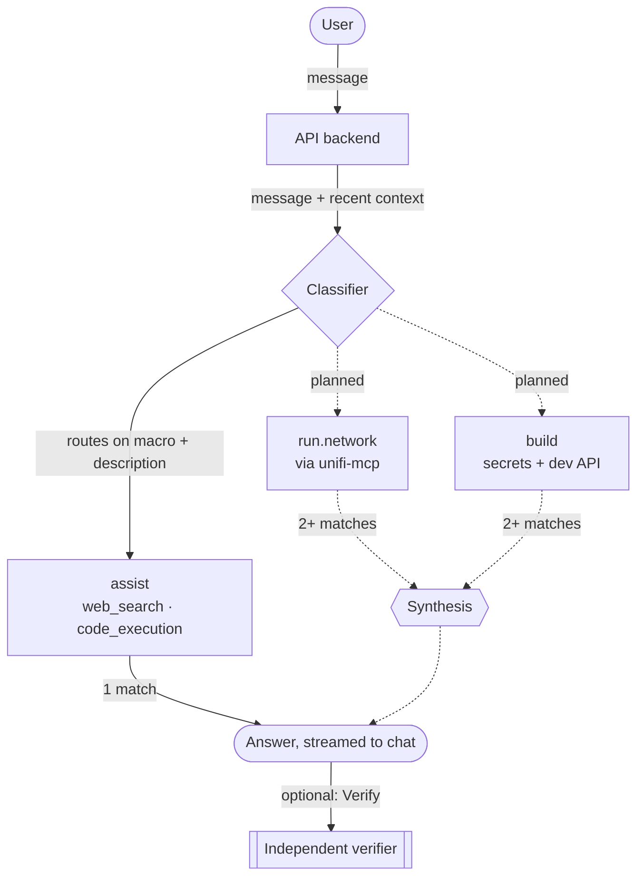

# The Shed

*A place you go to spend lots of time building, tinkering, and fixing things.*

The Shed is an agentic-first AI harness with three jobs: **Assist** (the everyday
personal-assistant work of running a life), **Build** (new projects, new features,
fixes — for The Shed itself or anything else), and **Run** (operating the
infrastructure underneath all of it — hosting, network, cloud, home tech stack). One
conversational interface, a growable registry of domain-specific sub-agents, fanning
out to whichever of them a message actually needs and fanning back in to one
answer — the pattern is laid out in full in [`docs/architecture.md`](docs/architecture.md).

The Shed is a **product**, not a single deployment: this repo holds the pattern and
the code, with no environment-specific content in it at all. Each deployment is a
**tenant**, running its own instance with its own private configuration — see
"Product vs. tenant" in the architecture doc for what that split actually means.

## How a message becomes an answer

Solid lines are live today. Dashed lines are designed and speced
([`docs/prd/core-agentic-loop.md`](docs/prd/core-agentic-loop.md)) but not yet
live-reachable — `run.network` and `build` aren't registered yet, and synthesis only
ever fires once a message matches two or more sub-agents, which can't happen with
only one registered.

## Status

Past the design phase — the Core Agentic Loop is built and running: real turns,
streamed over SSE, through a real classifier and a real sub-agent (`assist`, with
Anthropic's `web_search` and `code_execution` tools), plus a manual verifier and a
settings surface for per-sub-agent provider/model overrides. `v0.2.0` is the current
release. The other five subsystems below are fully speced but not yet built — see
each SPEC's own status, and the diagram above for how much of the Core Agentic Loop
itself is live versus still just designed.

## Documentation

- [`docs/architecture.md`](docs/architecture.md) — the portable pattern: macro
  routing, the sub-agent registry, fan-out/fan-in, the verifier, loop prevention and
  side-effect approval, secrets, multi-tenancy, testing discipline.
- [`docs/stack.md`](docs/stack.md) — the specific technologies chosen to build it.

Each subsystem has a PRD (requirements, the *why*) and a SPEC (technical design, the
*how*):

| Subsystem | PRD | SPEC |
|---|---|---|
| Bootstrap & Fleet Provisioning | [PRD](docs/prd/bootstrap.md) | [SPEC](docs/spec/bootstrap.md) |
| Core Agentic Loop | [PRD](docs/prd/core-agentic-loop.md) | [SPEC](docs/spec/core-agentic-loop.md) |
| GPU / Compute Management | [PRD](docs/prd/gpu-compute-management.md) | [SPEC](docs/spec/gpu-compute-management.md) |
| Secrets Management | [PRD](docs/prd/secrets-management.md) | [SPEC](docs/spec/secrets-management.md) |
| Auth | [PRD](docs/prd/auth.md) | [SPEC](docs/spec/auth.md) |
| Release Pipeline | [PRD](docs/prd/release-pipeline.md) | [SPEC](docs/spec/release-pipeline.md) |

## Contributing

See [`CONTRIBUTING.md`](CONTRIBUTING.md) for setup, the testing expectation, and how
a change lands. See [`AGENTS.md`](AGENTS.md) if you're an AI agent (coding assistant
or otherwise) working in this repo. See [`RELEASING.md`](RELEASING.md) for how
versions get cut.
